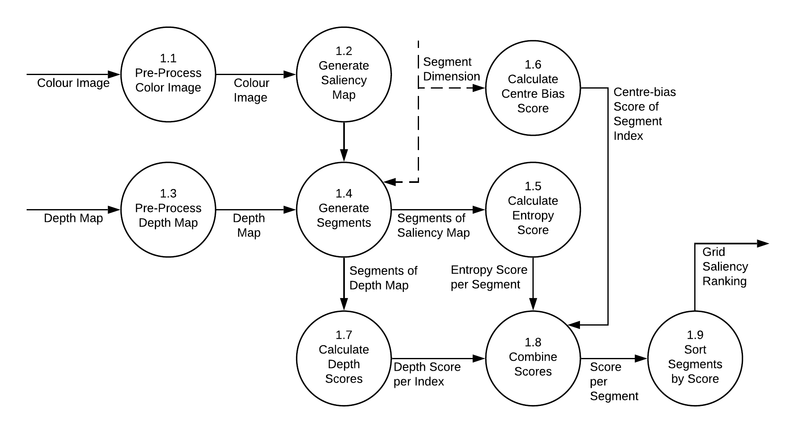
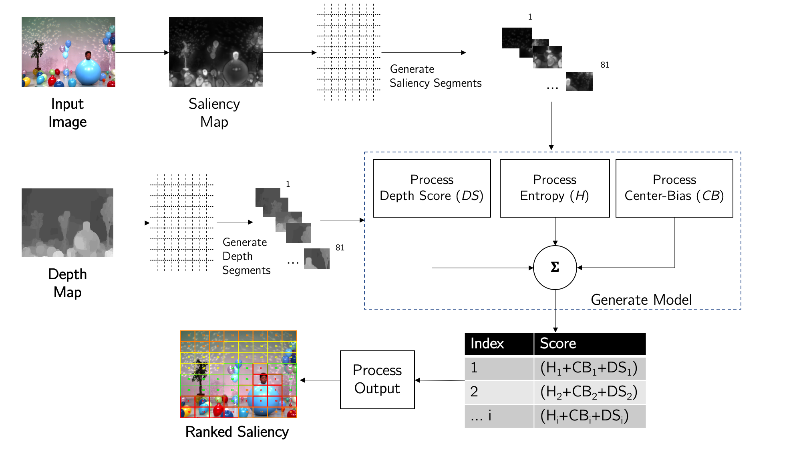
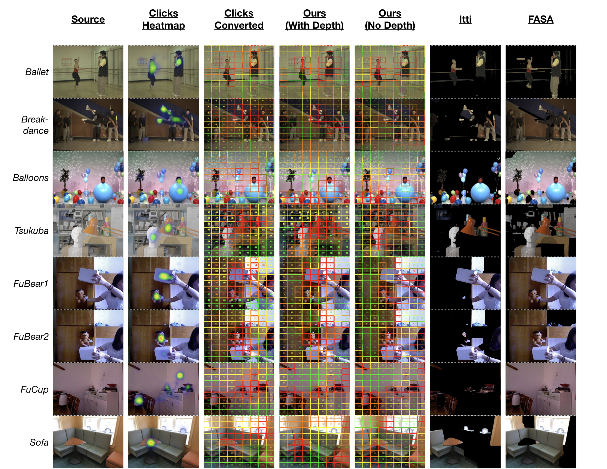
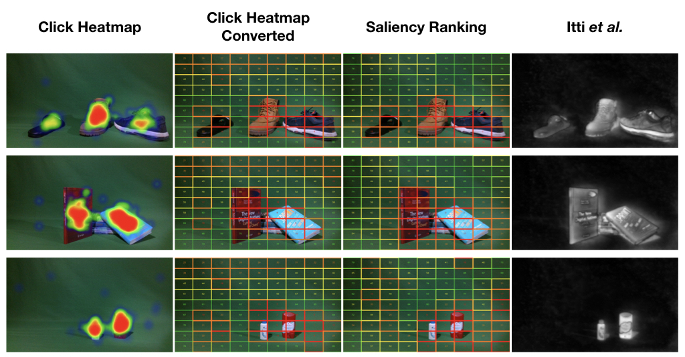

**<h1>SaRa</h1>**
<!-- Describe the software -->
**SaRa** (Saliency-Driven Object Ranking) is a saliency-driven ranking model that does not require any training and can efficiently rank the visual saliency of an image.

This technique can work with or without depth information. 

**<h2 name="abstract">Abstract</h2>**
*Effective immersion takes place when the user can relate to the 3D environment presented and interact with key objects. Efficiently predicting which objects in a scene are in the user’s attention, without using additional hardware, such as eye tracking solutions, provides an opportunity for creating more immersive scenes in real time and at lower costs. This is nonetheless algorithmically challenging. In this paper, we are proposing a technique that efficiently and effectively identifies the most salient objects in a scene. We show how it accurately matches user selection within 0.04s and is over 95% faster than other saliency algorithms while also providing a ranking of the most salient segments in a scene.*

**<h1 name="dfd">Overview</h1>**

**<h3 align="center" name="dfd">Data-Flow Diagram</h3>**

**<h3 align="center" name="dfd">Architecture</h3>**

**<h1 name="dfd">Demo</h1>**

**<h2 name="dfd">Online Test</h2>**

An online test was carried out to evaluate how the proposed technique compares to human behaviour. A set of images from the selected datasets were presented to the participant and for each image, the participants were asked the following question:

    Click/Tap on the point that attracts your attention when you first see the image. The point can be anywhere and includes persons or other objects

The tap or click coordinates on each presented image were
recorded.

*Visual representation of our saliency-driven ranking algorithm
compared to participant clicks and Itti’s saliency detection using the COTS dataset. The column on the left presents a the heatmaps of clicks from the online test. The second from the left column illustrates grid layout representation of the clicks such that they can be compared to our saliency-driven ranking method. The column on the right shows the same scene from the COTS dataset processed with Itti’s technique.*
